# 業務フロー 一覧

| 項番 | フロー     | 担当   | 従前                                                                                                                                   | 従後                                                                                                                                                                 |
| ---- | ---------- | ------ | -------------------------------------------------------------------------------------------------------------------------------------- | -------------------------------------------------------------------------------------------------------------------------------------------------------------------- |
| 1    | 契約手続き | 業務課 | 排出事業者が申込書作成、所内確認・稟議、収集運搬業者の登録、安全管理講習、現地確認・稟議、契約締結、契約情報更新処理などを紙媒体で作成 | 排出事業者が申込書作成、所内確認・稟議、収集運搬業者の登録、安全管理講習、現地確認・稟議、契約締結、契約情報更新処理などをシステムで作成(電子決裁・電子署名を用いる) |
| 2    | 搬入予約   | 業務課 | 排出事業者が搬入日・搬入物を予約(ホームページで申請)                                                                                   | 排出事業者が搬入日・搬入物を予約(搬入予約システムで申請)                                                                                                             |
| 3    | 搬入受付   | 業務課 | 計量棟で搬入受付、契約内容照合(OCR)、搬入物目視確認、重量計測                                                                          | 計量棟は廃止し、搬入受付は遠隔で対応、契約内容照合(カメラ情報による車両番号の自動認識、車両番号照会)、搬入物は台貫に設置されたカメラで確認、重量計測                 |
| 4    | 請求処理   | 業務課 | 月初に前月搬入分の請求チェック、請求書作成・印刷、請求書送付                                                                           | 月初に前月搬入分の請求チェック、請求書作成、請求書送付(印刷廃止)                                                                                                     |
| 5    | 会計処理   | 総務課 | 銀行入金消込、未入金チェック(通帳で確認)                                                                                               | 銀行入金消込、未入金チェック(システムで確認)                                                                                                                         |

## 0-1. 収集運搬事業者 全体図

**収集運搬事業者**

- ①電子申込 (マスター登録)
- ③電子申込 (変更届 (マスター内容))
- 車両登録  
  新規契約までに車両登録を実施
- 車両更新
- 安全管理講習  
  マスター登録完了後に実施できるようになり  
  搬入予約までに講習を実施

**搬入** 契約を結んでいる排出事業者の入力を代行するケース

- ⑥搬入予約
- マスター登録の完了と  
  排出事業者・事業団間の契約完了をもって  
  予約可能となる
- ⑦搬入受付

**搬入** 収集運搬事業者が搬入を行うケース

- ⑦搬入受付

Flowchart showing the overall process for collection and transportation business operators. It includes registration steps (electronic application, vehicle registration, safety training) and two cases for move-in (proxy for existing contract, or operator-led move-in).

## 0-2. 排出事業者 全体図

**排出事業者**

- ①電子申込 (マスター登録)  
  マスター登録完了をもって 新規契約申し込みが可能となる
- ③電子申込 (変更届 (マスター内容))
- 車両登録  
  搬入予約までに車両登録を実施
- 車両更新
- 安全管理講習  
  マスター登録完了後に実施できるようになり 搬入予約までに講習を実施

**契約** 新規契約完了後、契約内容の変更のケース

- ②電子申込 (新規契約申込) → ④電子決裁 (廃棄物) → ⑤電子契約
- ③電子申込 (変更契約申込) → ④電子決裁 (廃棄物) → ⑤電子契約
- ※収集運搬事業者に委託する場合は 委託先のマスタ登録をもって電子申込可能となる

**契約** 新規契約のみのケース

- ②電子申込 (新規契約申込) → ④電子決裁 (廃棄物) → ⑤電子契約

**搬入** 排出事業者が搬入を行うケース

- ⑥搬入予約  
  電子契約完了と 安全管理講習の完了をもって 予約可能となる
- ⑦搬入受付

**搬入** 収集運搬事業者が搬入を行うケース

- ⑥搬入予約  
  電子契約完了と 収集運搬事業者の安全管理講習の完了をもって 予約可能となる

**搬入**

- ⑥搬入予約
- ⑦搬入受付

Flowchart of the overall process for waste generators (排出事業者). It is divided into three main columns: 排出事業者 (Waste Generator), 契約 (Contract), and 搬入 (Move-in). The process starts with electronic registration (①) and application for contract (③) by the generator. The contract section includes two paths: one for new contracts (②, ④, ⑤) and one for contract changes (③, ④, ⑤). The move-in section shows three cases: generator-led (⑥, ⑦), collector-led (⑥), and a general case (⑥, ⑦). Arrows indicate the flow and dependencies between steps, including notes on vehicle registration, safety training, and委托 (commissioning) to collectors.

## スライド 7 ---

大鈴1 契約情報の更新についてPending  
鈴木 大介, 2026-03-17T05:14:04.079

### 1-1. 契約手続き ①電子申込(マスター登録) (前半)

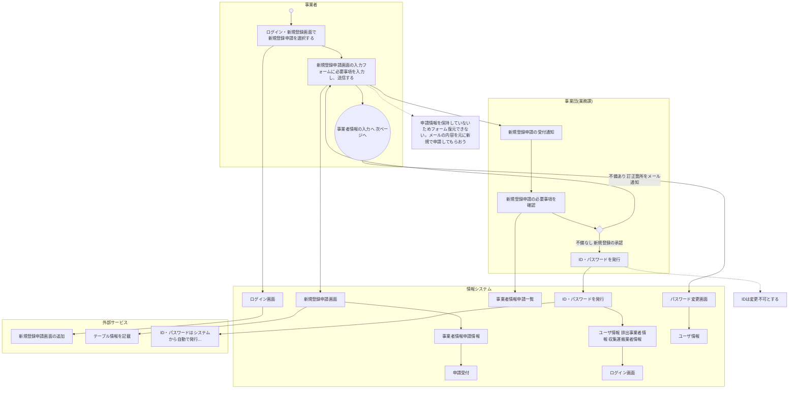

事業者

事業団(業務課)

情報システム

外部サービス

申請情報を保持していないためフォーム復元できない。メールの内容を元に新規で申請してもらおう

IDは変更不可とする

事業者情報の入力へ 次ページへ

新規登録申請の受付通知

新規登録申請の必要事項を確認

不備あり 訂正箇所をメール通知

不備なし 新規登録の承認

ID・パスワードを発行

事業者情報申請情報

申請受付

事業者情報申請一覧

ログイン画面

新規登録申請画面

ID・パスワードシステムのURL

発行されたID・パスワードでログイン

初回ログイン時にパスワード再設定

ユーザ情報 排出事業者情報 収集運搬業者情報

パスワード変更画面

新規登録申請画面の追加

テーブル情報を記載

ID・パスワードはシステムから自動で発行  
IDは法人番号+枝番とし、  
個人事業主の場合は法人番号ではなく自動採番  
パスワードは乱数による自動採番

EPCRA flowchart for electronic application (Master Registration) part 1. It shows the process from a business owner starting on the homepage to the system storing user information and sending ID/password. Key steps include login, filling the application form, system review, and password issuance. Red boxes highlight that the form cannot be recovered and that the ID cannot be changed.

開始 終了 分歧 アクティビティ 画面 テーブル 帳票 メール フロー フロー

Legend for the flowchart symbols: Start (solid circle), End (circle with dot), Decision (diamond), Activity (rounded rectangle), Screen (screen icon), Table (cylinder), Bill (document), Mail (envelope), Flow (solid arrow), and Flow (dashed arrow).

### 1-2. 契約手続き ①電子申込(マスター登録)(後半)

**事業者**

- 前ページより
- マイページの**事業者情報メニュー**から**事業者情報登録**を選択し、必要事項を入力
- 入力内容の確認・申請
- 不備あり 入力画面へ戻る
- 不備なし 入力内容を送信
- 差し戻し通知 訂正箇所の通知
- 「事業者情報登録」以外の申請が選択可能になる
- 排出事業者の場合 新規契約申込が可能になる  
  収集運搬事業者の場合 安全管理講習の受講が可能になる

**事業団(業務課)**

- 事業者情報の入力、登記事項証明書、許可証、免許証コピーなどを添付
- 必須事項の未記入や入力形式が異なる場合 遷移不可
- 「事業者情報登録」以外の申請は選択不可にする。  
  メニュー名の誤記修正
- 事業者情報の登録申請の通知
- 事業者情報の確認
- 不備あり 訂正箇所をメール送付
- 不備なし 事業者情報の確定

**情報システム**

- 利用者区分を参照
- ユーザ情報
- 事業者情報登録画面
- 入力内容確認画面
- 入力された情報の登録
- 排出事業者情報 収集運搬事業者情報
- 事業者情報申請一覧
- 承認ステータスの更新
- 排出事業者情報 収集運搬事業者情報
- 確定した内容をメール送付

**外部サービス**

- 可能になる操作の説明を事業者の種類ごとに明記

A detailed swimlane flowchart showing the 'Contract Procedure ① Electronic Application (Master Registration) (后半)' across four lanes: 事業者 (Business), 事業団(業務課) (Business Association (Business Office)), 情報システム (Information System), and 外部サービス (External Service). The process involves business registration, input content confirmation, application submission, and final approval, with various feedback loops and notifications.

● 開始 ● 終了 ◇ 分歧 **アクティビティ** </> 画面 ● データ 帳票 ✉ メール → フロー - - - フロー

### 1-3. 契約手続き ①電子申込（車両登録）

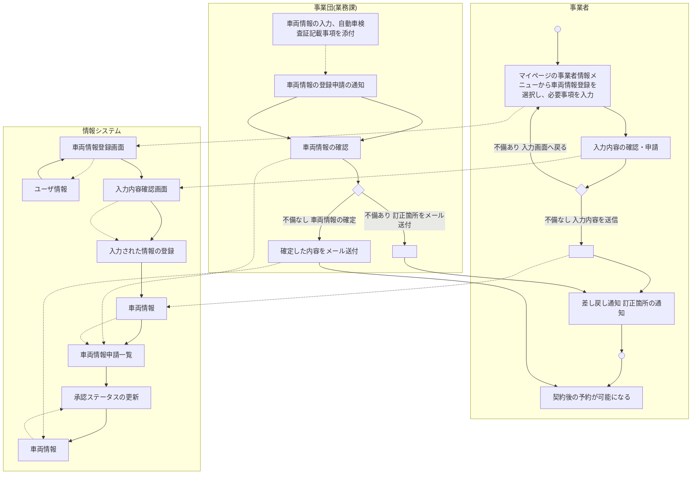

**事業者**

- マスター登録後 随時
- マイページの事業者情報メニューから車両情報登録を選択し、必要事項を入力
- 入力内容の確認・申請
- 不備あり 入力画面へ戻る
- 不備なし 入力内容を送信
- 差し戻し通知 訂正箇所の通知
- 契約後の予約が可能になる

**事業団(業務課)**

- 車両情報の入力、自動車検査証記載事項を添付
- 必須事項の未記入や入力形式が異なる場合 遷移不可
- 車両情報の登録申請の通知
- 車両情報の確認
- 不備あり 訂正箇所をメール送付
- 不備なし 車両情報の確定
- 確定した内容をメール送付

**情報システム**

- 利用者区分を参照
- ユーザ情報
- 車両情報登録画面
- 入力内容確認画面
- 入力された情報の登録
- 車両情報
- 車両情報申請一覧
- 承認ステータスの更新
- 車両情報

**外部サービス**

EPC graph diagram for vehicle registration process. Lifelines: 事業者 (Business), 事業団(業務課) (Business Group - Business Office), 情報システム (Information System), 外部サービス (External Service). The process involves user registration, vehicle info input, approval flow, and final email notifications.

● 開始   ● 終了   ◇ 分歧   [アクティビティ]   </> 画面   ● データ   帳票   ✉ メール   → フロー   - - - フロー

### 1-4. 契約手続き ②電子申込(新規契約申込)(前半)

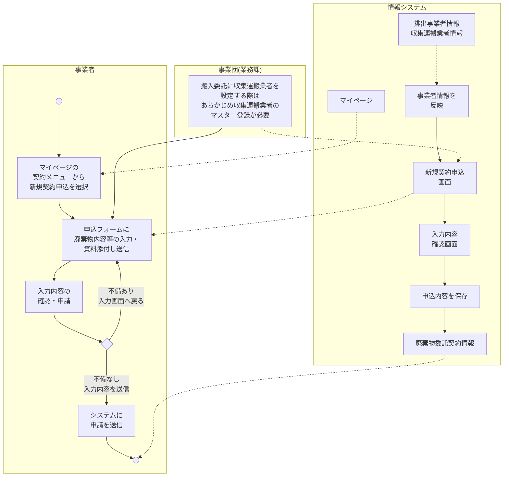

A swimlane flowchart showing the process of electronic application for a new contract. The lanes are 事業者 (Business Operator), 事業団(業務課) (Business Group (Business Office)), 情報システム (Information System), and 外部サービス (External Service). The process starts with the Business Operator selecting a new contract application from their My Page, leading to filling out a form, and then confirming the application. The Information System handles the My Page, data reflection, and saving of application content. A decision point determines if the application is complete or needs more input.

● 開始    ◎ 終了    ◇ 分岐    [アクティビティ]    </> 画面    ● データ    □ 帳票    ✉ メール    → フロー    -.-> フロー

Legend for the flowchart symbols: 開始 (Start), 終了 (End), 分岐 (Decision), アクティビティ (Activity), 画面 (Screen), データ (Data), 帳票 (Form), メール (Email), フロー (Flow), and フロー (Flow - dashed line).

## 1-5. 契約手続き ②電子申込(新規契約申込)(後半)

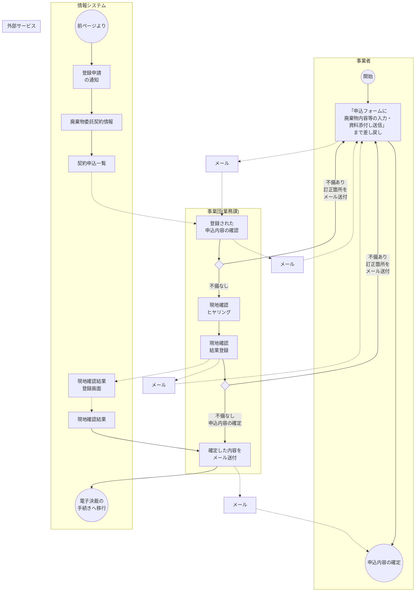

A swimlane flowchart showing the second half of a contract process. It involves four lanes: 事業者 (Business), 事業団(業務課) (Business Group - Business Office), 情報システム (Information System), and 外部サービス (External Service). The process starts with a business receiving a form, filling it out, and returning it. The system sends a registration notification, and the business registers the application. The system checks the registration, and if incomplete, sends an email for correction. If complete, it goes to on-site confirmation. After on-site confirmation, the result is registered. If incomplete, it sends another email for correction. If complete, the business confirms the application content. The system then sends the confirmed content via email, leading to electronic settlement.

● 開始    ● 終了    ◇ 分岐    [アクティビティ]    </> 画面    [データ]    [帳票]    [メール]    → フロー    - - - フロー

Legend for the flowchart symbols: 開始 (Start), 終了 (End), 分岐 (Decision), アクティビティ (Activity), 画面 (Screen), データ (Data), 帳票 (Form), メール (Email), フロー (Flow).

### 1-6. 契約手続き ③電子申込(変更契約申込)(前半)

※契約の申込は排出事業者が行う

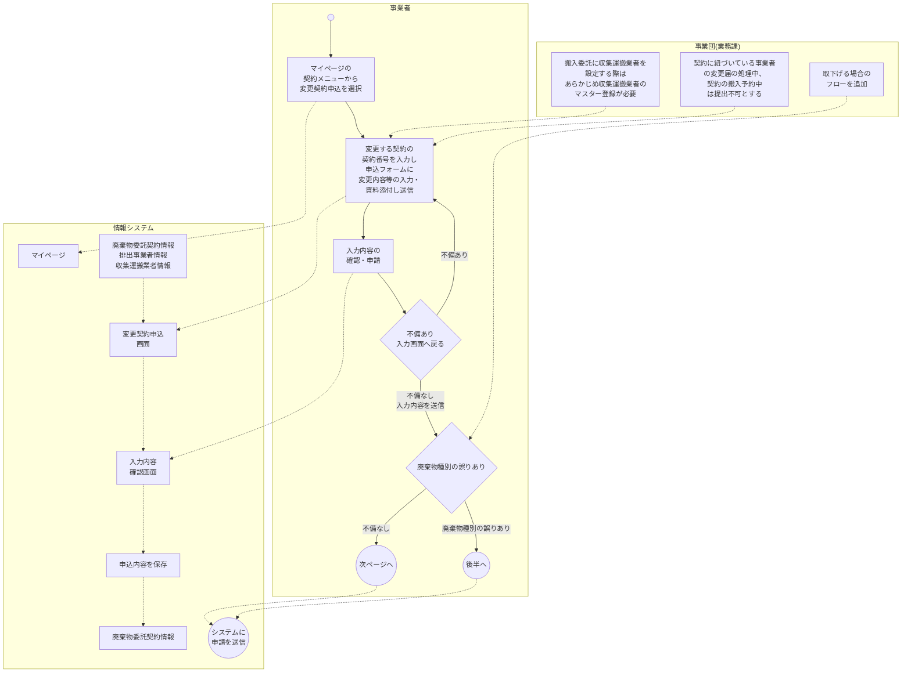

Flowchart of the contract procedure (前半) across four swimlanes: 事業者 (Business Operator), 事業団(業務課) (Organization (Business Office)), 情報システム (Information System), and 外部サービス (External Service). The process starts with the Business Operator selecting '変更契約申込' from their 'マイページ'. The Information System shows the '変更契約申込画面' with data from '廃棄物委託契約情報' and '収集運搬業者情報'. The Business Operator completes input and submits. A decision point '不備あり' (Incomplete) loops back to the input screen, while '不備なし' (Complete) sends data to the Business Office. Another decision point '廃棄物種別の誤りあり' (Wrong waste type) leads to '次ページへ' (Next page), while '不備なし' leads to '後半へ' (Next half) via 'システムに申請を送信'.

● 開始   ● 終了   ◇ 分歧   [アクティビティ]   </> 画面   ● データ   □ 帳票   ✉ メール   → フロー   - - - フロー

### 1-7. 契約手続き ③電子申込(変更契約申込)(取下げ)

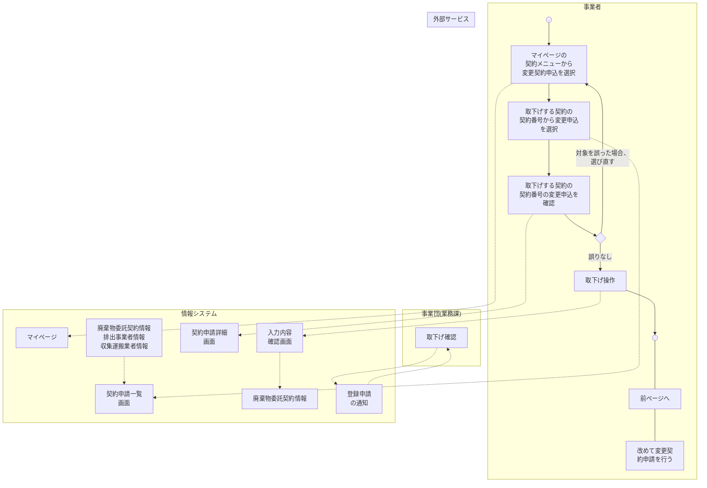

※契約の申込は排出事業者が行う

A swimlane flowchart showing the process of withdrawing a contract application. It involves four lanes: 事業者 (Business Operator), 事業団(業務課) (Organization (Business Office)), 情報システム (Information System), and 外部サービス (External Service). The process starts with the Business Operator selecting a contract to withdraw from their homepage, followed by system processing, confirmation by the Business Office, and final system updates and notifications.

開始 終了 分歧 アクティビティ 画面 データ 帳票 メール フロー フロー

Legend for the flowchart symbols: 開始 (Start), 終了 (End), 分歧 (Decision), アクティビティ (Activity), 画面 (Screen), データ (Data), 帳票 (Form), メール (Email), フロー (Flow).

### 1-8. 契約手続き ③電子申込(変更契約申込)(後半)

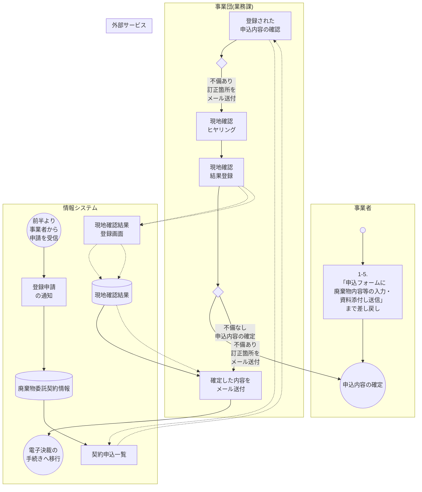

A swimlane flowchart showing the latter half of an electronic application process. It involves four lanes: 事業者 (Business), 事業団(業務課) (Business Group (Business Office)), 情報システム (Information System), and 外部サービス (External Service). The process starts from the previous half, involves registration notification, application review, on-site check, result registration, and final approval and payment processing.

● 開始    ◎ 終了    ◇ 分岐    [アクティビティ]    [画面]    [(データ)]    [帳票]    [メール]    → フロー    -.- フロー

Legend for the flowchart symbols: 開始 (Start), 終了 (End), 分岐 (Decision), アクティビティ (Activity), 画面 (Screen), データ (Data), 帳票 (Form), メール (Email), フロー (Flow).

### 1-9. 契約手続き ④電子決裁(廃棄物)

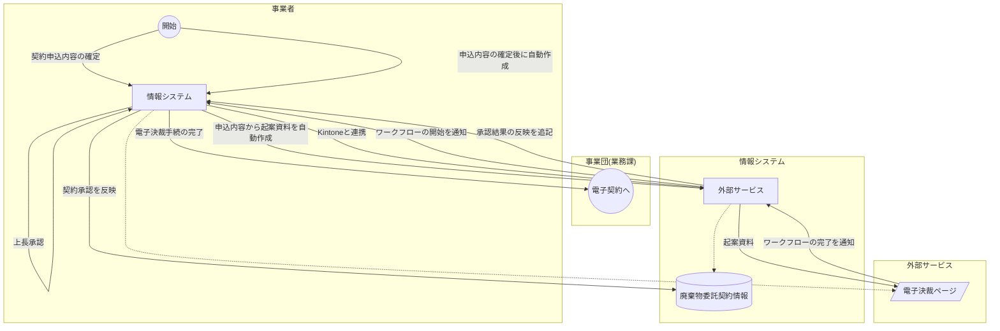

A swimlane flowchart showing the contract process (Electronic Approval for Waste Disposal) across four lanes: 事業者 (Business), 事業団(業務課) (Business Group - Business Office), 情報システム (Information System), and 外部サービス (External Service).

Legend for the flowchart symbols: 開始 (Start), 終了 (End), 分岐 (Branch), アクティビティ (Activity), 画面 (Screen), データ (Data), 帳票 (Form), メール (Email), フロー (Flow).

### 1-10. 契約手続き ⑤電子契約

**事業者**

- 電子契約書ページのURLを送付 (Email icon)
- 電子契約書ページにアクセス 電子署名・タイムスタンプ
- 締結完了の通知 安全管理講習の受講案内 ※収集運搬を委託する場合、収集運搬事業者も宛先に含める (Email icon)
- 契約締結完了 システム機能の開放 (End symbol)

**事業団(業務課)**

- 電子決裁の完了 (Start symbol) → 契約書作成業務
- 契約締結の確認

**情報システム**

- 新規・変更契約申込の内容を反映 → 廃棄物委託契約情報 (Data icon)
- 保存場所を紐づけ → DBサーバ → 廃棄物委託契約情報 (Data icon) → 契約申込一覧 (画面 icon)

**外部サービス**

- 署名依頼の通知 → 契約書作成ページ (画面 icon) → freeeサインと連携 契約書作成 → 電子契約書ページ (画面 icon) → freeeサインと連携 電子署名・タイムスタンプ → 締結後の契約書を保存 (帳票 icon: PDF) → 署名完了の通知

**Callouts:**

- 署名にはfreeeサインへの登録は必要なし
- 収集運搬事業者が宛先になり得ることを明記

A swimlane flowchart detailing the electronic contract process across four lanes: 事業者 (Business), 事業団(業務課) (Business Association (Business Office)), 情報システム (Information System), and 外部サービス (External Service). The process starts with a decision in the Business Association lane, leading to contract creation, which involves the Information System and External Service (freee sign). It concludes with contract confirmation and system function release in the Business lane. Includes callouts about 'freee sign' registration and priority for collection/transportation businesses.

開始 終了 分歧 アクティビティ 画面 データ 帳票 メール フロー フロー

Legend for the flowchart symbols: 開始 (Start), 終了 (End), 分歧 (Split), アクティビティ (Activity), 画面 (Screen), データ (Data), 帳票 (Form), メール (Email), フロー (Flow).

### 1-11. 契約手続き ③電子申込(変更届(マスター内容))

```mermaid
graph TD
    subgraph 事業者 [事業者 (Business Operator)]
        Start(( )) --> Act1[マイページから
「変更届出書」を
クリック]
        Act1 --> Act2[申込フォームに
変更内容の入力・
資料添付し送信]
        Act2 --> Act3[入力内容の
確認・申請]
        Act3 --> Dec1{ }
        Dec1 -- "不備あり
入力画面へ戻る" --> Act2
        Dec1 -- "不備なし
入力内容を送信" --> Mail1[✉️]
        Mail1 --> End(( ))
        style End stroke-width:4px
        Note1[変更届内容の
登録完了] -.-> End
    end

    subgraph 事業団 [事業団(業務課) (Business Group)]
        Warn1[新規・変更契約申込
搬入予約の登録中は
変更届の提出不可] -.-> Act1
        Warn2[必須事項の未記入や
入力形式が異なる場合
遷移不可] -.-> Act2
        Act4[登録された
変更届内容の確認] --> Dec2{ }
        Dec2 -- "不備あり
訂正箇所を
メール送付" --> Mail2[✉️]
        Mail2 -.-> Act2
        Dec2 -- "不備なし
申込内容の確定" --> Mail3[✉️]
    end

    subgraph システム [情報システム (Information System)]
        Scr1[
 マイページ] --> Data1[(排出事業者情報
収集運搬業者情報)]
        Data1 -- "事業者情報を
反映" --> Scr2[
 変更届出書
入力画面]
        Scr2 --> Scr3[
 入力内容
確認画面]
        Scr3 -- "入力内容を保存" --> Data2[(変更届(排出事業者)
変更届(収集運搬業者))]
        Data2 --> Scr4[
 事業者情報
申請一覧]
        Act5[申請通知] --> Act4
        Mail3 --> Act6[確定した内容を
メール送付]
        Act6 -- "届出内容を反映" --> Data3[(排出事業者情報
収集運搬業者情報)]
    end

    subgraph 外部 [外部サービス (External Services)]
        Ext1[ ]
    end

    Mail1 -.-> Act5
    Act6 -.-> Mail1
    Act6 -.-> Ext1

```

The diagram illustrates the electronic application process for changing master content. It involves the following steps:

- Business Operator:\*\* Starts by clicking the change notification on their My Page. They fill out the form, attach documents, and submit. If there are errors (checked by the system or business group), they must return to the input screen. Once finalized, they receive a completion notification.
- Business Group:\*\* Reviews the submitted change notifications. They can send a correction request via email if there are issues or confirm the application if everything is correct.
- Information System:\*\* Manages the data flow, reflecting existing operator info onto the input screens, saving draft data, generating application lists, and updating the master database once changes are confirmed.
- External Services:\*\* Receives email notifications regarding the confirmed changes.

● 開始 (Start)    ◎ 終了 (End)    ◇ 分岐 (Decision)    [ ] アクティビティ (Activity)    </> 画面 (Screen)    🛢️ データ (Data)    📄 帳票 (Form)    ✉️ メール (Email)    → フロー (Flow)    ┈→ フロー (Flow)

## 1-12. 契約手続き 安全管理講習

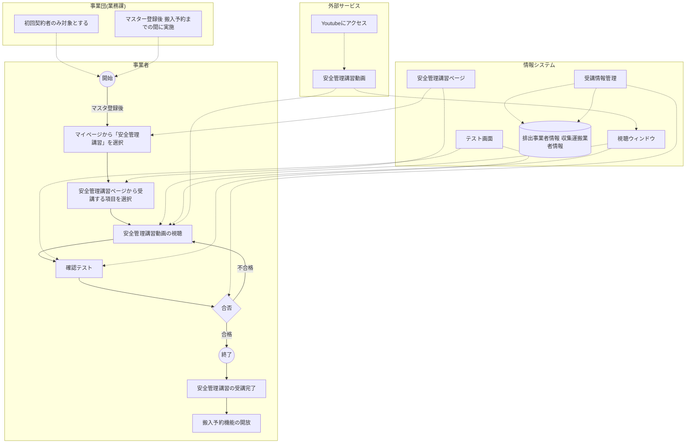

**事業者**

- マスタ登録後
- マイページから「安全管理講習」を選択
- 安全管理講習ページから受講する項目を選択
- 安全管理講習動画の視聴
- 確認テスト
- 合否 (不合格: リトライ, 合格: 次へ)
- 安全管理講習の受講完了
- 搬入予約機能の開放

**事業団(業務課)**

- 初回契約者のみ対象とする
- マスター登録後 搬入予約までの間に実施

**情報システム**

- 安全管理講習ページ (別ウィンドウで表示)
- 視聴ウィンドウ
- テスト画面
- 受講情報管理
- 排出事業者情報 収集運搬業者情報

**外部サービス**

- Youtubeにアクセス
- 安全管理講習動画 (埋め込み表示)

**備考:**

- 合否による分歧に変更
- 受講対象者の整理 テストの合否を記録 (合格でなければ搬入予約不可) 「受講フラグ」ではなく「受講情報」に修正

A swimlane flowchart detailing the 'Safety Management Training' process across four lanes: 事業者 (Business Operator), 事業団(業務課) (Business Group (Business Office)), 情報システム (Information System), and 外部サービス (External Service). The process starts with 'Master Registration' and ends with 'Training Completed' and 'Relocation Reservation Function Opened'. It includes steps for selecting training items, watching videos, taking a test, and managing training information.

● 開始    ◎ 終了    ◇ 分歧    [アクティビティ]    </> 画面    [(データ)]    [帳票]    [メール]    → フロー    -.- フロー

Legend for the flowchart symbols: 開始 (Start), 終了 (End), 分歧 (Decision), アクティビティ (Activity), 画面 (Screen), データ (Data), 帳票 (Form), メール (Email), フロー (Flow).

## 2. 搬入予約 ⑥搬入予約

```mermaid
graph TD
        subgraph 事業者
            Start(( )) --> A[マイページのメニューから搬入予約を選択]
            A --> B[搬入予定表面面から空いている予約枠を選択]
            B --> C[搬入予約申請ページに必要事項を記入]
            C --> D[入力内容の確認・申請]
            D --> E{ }
            E -- 不備あり 入力画面へ戻る --> B
            E -- 不備なし 入力内容を送信 --> F[申請内容を予約データに登録]
            F --> G[受付完了と搬入予約時間の通知]
            G --> End((( ))
        end
        subgraph "事業団(業務課)"
            H[補足を追記]
        end
        subgraph 情報システム
            I[搬入予約情報] --> J[搬入予定表画面]
            J --> K[搬入予約入力画面]
            K --> L[入力内容確認画面]
            L --> F
            F --> M[搬入予約情報]
        end
        subgraph 外部サービス
            N[搬入予定表から搬入予約を行うフローに修正]
            O[QRコードの発行を削除]
        end
        H -.-> A
        H -.-> B
        H -.-> C
        H -.-> D
        H -.-> J
        H -.-> K
        H -.-> L
        H -.-> F
        H -.-> M
        N -.-> J
        O -.-> F
        G -.-> P[※搬入を収集運搬事業者が行う場合、宛先に収集運搬事業者を含める]
        P -.-> H
        H -.-> Q[※排出事業者・収集運搬事業者の代わって事業団職員が予約を行う場合、「事業者」エリアの操作を事業団が行う]
        Q -.-> A

```

UML Activity Diagram for Move Reservation process. Lifelines: 事業者 (Business Operator), 事業団(業務課) (Business Group (Business Office)), 情報システム (Information System), 外部サービス (External Service). The process involves selecting a reservation slot, filling out an application form, confirming input, and then either completing the reservation or returning to input if there are errors. It includes data flows for reservation information and screens, and external service interactions for QR code cancellation and notifications.

● 開始
⦿ 終了
◇ 分岐
アクティビティ
画面
データ
帳票
メール
→ フロー

- - - フロー

### 3-1. 搬入受付 ⑦搬入受付(入場～搬入予約の確認)

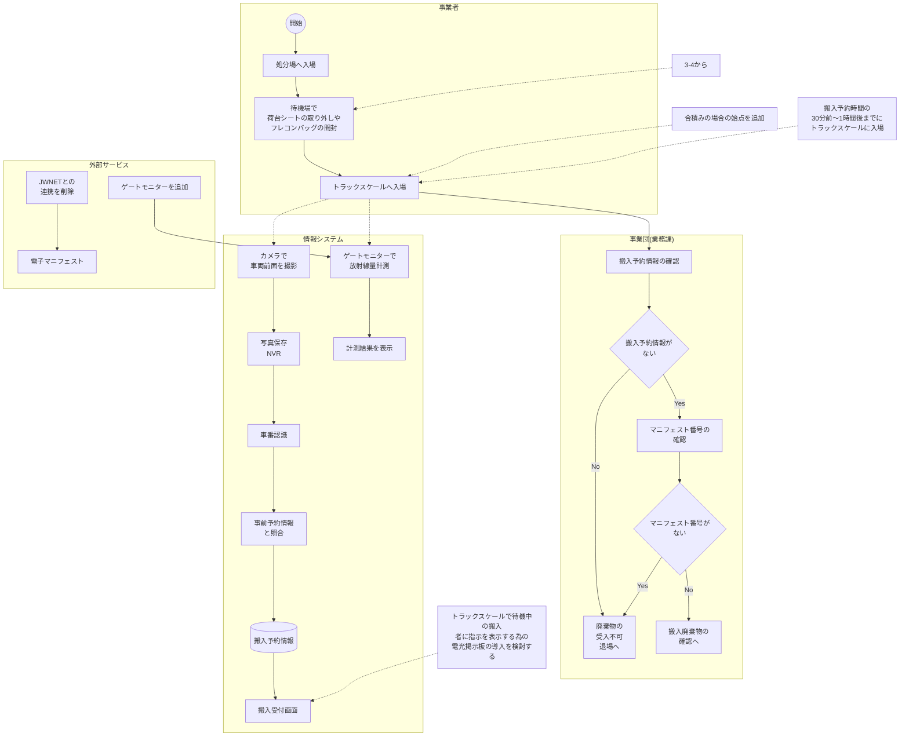

A swimlane flowchart showing the process of '搬入受付' (Move-in Reception) across four lanes: 事業者 (Business Operator), 事業団(業務課) (Business Group (Business Office)), 情報システム (Information System), and 外部サービス (External Service). The process starts with the Business Operator entering the site and waiting for a truck scale. The Business Group confirms move-in reservation information and manifest numbers. The Information System uses a gate monitor for radiation measurement, camera for vehicle front photography, and NVR for photo storage. It also displays results and generates a move-in reception screen. External services include adding a gate monitor, removing JWNET linkage, and generating an electronic manifest. A note suggests considering an electronic display board for instructions to movers.

● 開始 ● 終了 ◇ 分歧 アクティビティ </> 画面 [(Data)] データ [Form] 帳票 [Email] メール → フロー - - - フロー

Legend for the flowchart symbols: 開始 (Start), 終了 (End), 分歧 (Decision), アクティビティ (Activity), 画面 (Screen), データ (Data), 帳票 (Form), メール (Email), フロー (Flow), and フロー (Flow - dashed line).

### 3-2. 搬入受付 ⑦搬入受付(搬入廃棄物の確認～蛍光X線検査)

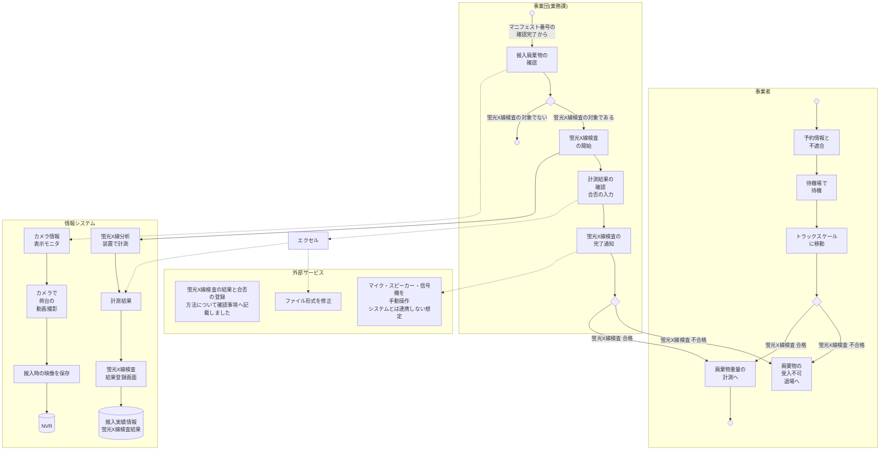

A detailed swimlane flowchart showing the process of receiving and inspecting waste. The chart is divided into four horizontal lanes: 事業者 (Business Operator), 事業団(業務課) (Business Group (Business Office)), 情報システム (Information System), and 外部サービス (External Service). The process starts with the Business Operator providing appointment information. The Business Group confirms the manifest number, inspects the waste, and decides if X-ray inspection is needed. If not, weight is measured. If yes, inspection starts, results are entered into an Excel sheet, and the system registers the result. A note indicates the file format needs correction. Finally, the operator moves to a truck scale, and a decision is made: if不合格 (unqualified), entry is denied; if合格, weight is measured. The Information System handles camera footage and data storage. External notes mention manual operation of microphones and system integration issues.

● 開始    ◎ 終了    ◇ 分岐    [アクティビティ]    </> 画面    [(データ)]    [帳票]    [メール]    → フロー    - - - フロー

Legend for the flowchart symbols: 開始 (Start) is a solid black circle, 終了 (End) is a circle with a dot, 分岐 (Branch) is a diamond, アクティビティ (Activity) is a rounded rectangle, 画面 (Screen) is a monitor icon, データ (Data) is a cylinder, 帳票 (Form) is a document icon, メール (Email) is an envelope icon, フロー (Flow) is a solid arrow, and フロー (Flow) is a dashed arrow.

### 3-3. 搬入受付 ⑦搬入受付(廃棄物重量の計測～簡易溶出試験)

```mermaid
graph TD
        subgraph 事業者
            Start(( )) --> BusinessGroup[事業団(業務課)]
            End1((処分場へ)) --> BusinessGroup
            End2((処分場へ)) --> BusinessGroup
        end

        subgraph "事業団(業務課)"
            Start1((搬入廃棄物の確認完了から)) --> A[積載量計測開始]
            A --> B[過積載の確認]
            B --> C{ }
            C -- 過積載である --> D[搬入物チェックリストの入力]
            C -- 簡易溶出試験の対象でない --> End1
            D --> E{ }
            E -- 簡易溶出試験の対象である --> F[展開ヤードにて簡易溶出試験]
            F --> G[計測結果の確認合否の入力]
        end

        subgraph 情報システム
            G --> H[CSV 計測結果]
            G --> I[簡易溶出試験結果登録画面]
            I --> J[搬入実績情報]
            J --> K[サンプリング分析結果を送付]
            K --> L[合格or不合格のみ通知]
            L --> End2
        end

        subgraph 外部サービス
            M[搬入車両に風袋重量・容量が記録されている場合
この時点で廃棄物の積載量を算出]
            N[簡易溶出試験の結果と合否の登録方法について
確認事項へ記載しました
計測結果は手入力であることを明示しました]
        end

        A -.-> A1[トラックスケールキャパライザーで重量・容量取得]
        A1 -.-> A2[登録車両情報]
        B -.-> B1[搬入受付画面]
        D -.-> D1[搬入物チェックリスト画面]
        D1 -.-> D2[搬入実績情報]
        I -.-> I1[搬入実績情報]
        I1 -.-> I2[サンプリング分析結果]
        M -.-> B1
        N -.-> I1

```

The flowchart illustrates the process for waste acceptance, specifically steps 7 and 8. It is divided into four horizontal lanes: 事業者 (Business Operator), 事業団(業務課) (Business Group (Business Office)), 情報システム (Information System), and 外部サービス (External Service).

- 事業者 (Business Operator):\*\* The process starts with a start symbol (●) and ends with two end symbols (⦿) leading to a disposal site (処分場へ). A decision diamond (◇) leads to a box "廃棄物の受入不可 退場へ" (Waste acceptance impossible, exit) if "不合格" (不合格 -不合格).
- 事業団(業務課) (Business Group (Business Office)):\*\* The process begins with "搬入廃棄物の確認完了から" (From completion of waste acceptance confirmation) leading to "積載量計測開始" (Start weight measurement). This is followed by "過積載の確認" (Overloading confirmation). A decision diamond (◇) checks if it is "過積載である" (Overloaded). If yes, it leads to "搬入物チェックリストの入力" (Input waste checklist). If no, it checks if it is the "簡易溶出試験の対象でない" (Not subject to simple elution test). If not subject, it ends at the disposal site. If subject, it leads to "展開ヤードにて簡易溶出試験" (Simple elution test at expansion yard). This is followed by "計測結果の確認合否の入力" (Input confirmation of measurement results). A red dashed arrow points from the "簡易溶出試験結果登録画面" (Simple elution test result registration screen) to this step.
- 情報システム (Information System):\*\* "積載量計測開始" leads to "トラックスケールキャパライザーで重量・容量取得" (Weight and volume acquisition with truck scale calibrator), which is linked to "登録車両情報" (Registered vehicle information). "過積載の確認" leads to "搬入受付画面" (Waste acceptance screen). "搬入物チェックリストの入力" leads to "搬入物チェックリスト画面" (Waste checklist screen), which is linked to "搬入実績情報" (Waste acceptance history information). "計測結果の確認合否の入力" leads to "CSV 計測結果" (CSV measurement results) and "簡易溶出試験結果登録画面" (Simple elution test result registration screen). This screen is linked to "搬入実績情報" and "サンプリング分析結果" (Sampling analysis results). "搬入実績情報" leads to "サンプリング分析結果を送付" (Send sampling analysis results), which is linked to "合格or不合格のみ通知" (Notify only pass or fail). This leads to the end symbol (⦿) at the disposal site.
- 外部サービス (External Service):\*\* A box "搬入車両に風袋重量・容量が記録されている場合  
  この時点で廃棄物の積載量を算出" (If windbag weight and volume are recorded in the incoming vehicle, calculate the waste weight at this point) is linked to "搬入受付画面". Another box "簡易溶出試験の結果と合否の登録方法について  
  確認事項へ記載しました  
  計測結果は手入力であることを明示しました" (Regarding the method of registering the results and pass/fail of the simple elution test, it is noted in the confirmation items. It is explicitly stated that the measurement results are manual input) is linked to "簡易溶出試験結果登録画面".

Flowchart of the waste acceptance process (Step 7: Weight measurement to simple elution test).

● 開始   ⦿ 終了   ◇ 分歧   [アクティビティ]   </> 画面   [データ]   [帳票]   [メール]   → フロー   - - - フロー

### 3-4. 搬入受付 ⑦搬入受付(風袋容量の計測～搬入受付完了)

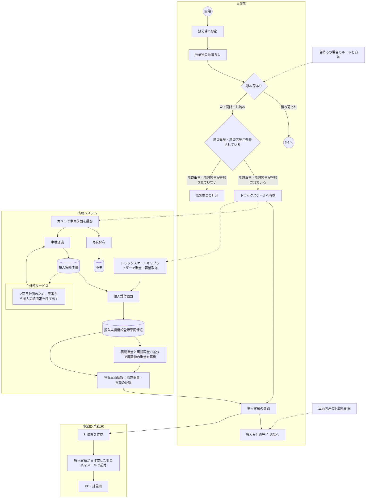

A detailed swimlane flowchart showing the process from '搬入受付' (Move-in Reception) to '搬入受付完了' (Move-in Reception Completed). The chart is divided into four horizontal lanes: 事業者 (Business Operator), 事業団(業務課) (Business Group (Business Office)), 情報システム (Information System), and 外部サービス (External Service). The process starts with the Business Operator moving to the site and unloading waste. A decision point '積み荷あり' (Load present) leads to '3-1へ' (To 3-1) if yes, or '全て荷降ろし済み' (All unloading completed) if no. A red box highlights the '積み荷あり' path, with a note '合積みの場合のルートを追加' (Add route for combined loads). The next decision point is '風袋重量・風袋容量が登録されている' (Bag weight/capacity registered). If yes, it goes to 'トラックスケールへ移動' (Move to truck scale). If no, it goes to '風袋重量の計測' (Measure bag weight). From 'トラックスケールへ移動', the flow goes to '風袋重量の計測' and also to '搬入実績の登録' (Register move-in record). '風袋重量の計測' leads to '過積載の確認' (Check overloading) and '搬入実績の登録'. '過積載の確認' leads to '搬入実績の登録'. '搬入実績の登録' leads to '計量票を作成' (Create weighing ticket) and '搬入受付の完了 退場へ' (Move to move-in completion and exit). A red box highlights the path from '搬入実績の登録' to '搬入受付の完了 退場へ' with the note '車両洗浄の記載を削除' (Delete vehicle cleaning record). In the Information System lane, 'カメラで車両前面を撮影' (Take photo of vehicle front) leads to '写真保存' (Save photo) and '車番認識' (License plate recognition). '車番認識' leads to '搬入実績情報' (Move-in record info) and '2回目計測のため、車番から搬入実績情報を呼び出す' (Call move-in record info by license plate for 2nd measurement). '搬入実績情報' leads to '搬入受付画面' (Move-in reception screen). 'トラックスケールキャプライザーで重量・容量取得' (Get weight/capacity with truck scale capraizer) leads to '搬入受付画面'. '搬入受付画面' leads to '搬入実績情報登録車両情報' (Move-in record info registered vehicle info) and '計量票を作成'. '搬入実績情報登録車両情報' leads to '積載重量と風袋容量の差分で廃棄物の重量を算出' (Calculate waste weight by difference between load weight and bag capacity) and '登録車両情報に風袋重量・容量の記録' (Record bag weight/capacity in registered vehicle info). '積載重量と風袋容量の差分で廃棄物の重量を算出' leads to '登録車両情報に風袋重量・容量の記録'. '登録車両情報に風袋重量・容量の記録' leads to '搬入実績から作成した計量票をメールで送付' (Send weighing ticket created from move-in record by email). '搬入実績から作成した計量票をメールで送付' leads to 'PDF 計量票' (PDF weighing ticket). The process ends at '搬入受付の完了 退場へ' (Move to move-in completion and exit).

開始
終了
分岐
アクティビティ
画面
データ
帳票
メール
フロー
フロー

Start symbol End symbol Decision symbol Activity symbol Screen symbol Data symbol Ticket symbol Email symbol Flow symbol Dashed flow symbol

## 4. 請求処理 ⑧電子請求(要検討)

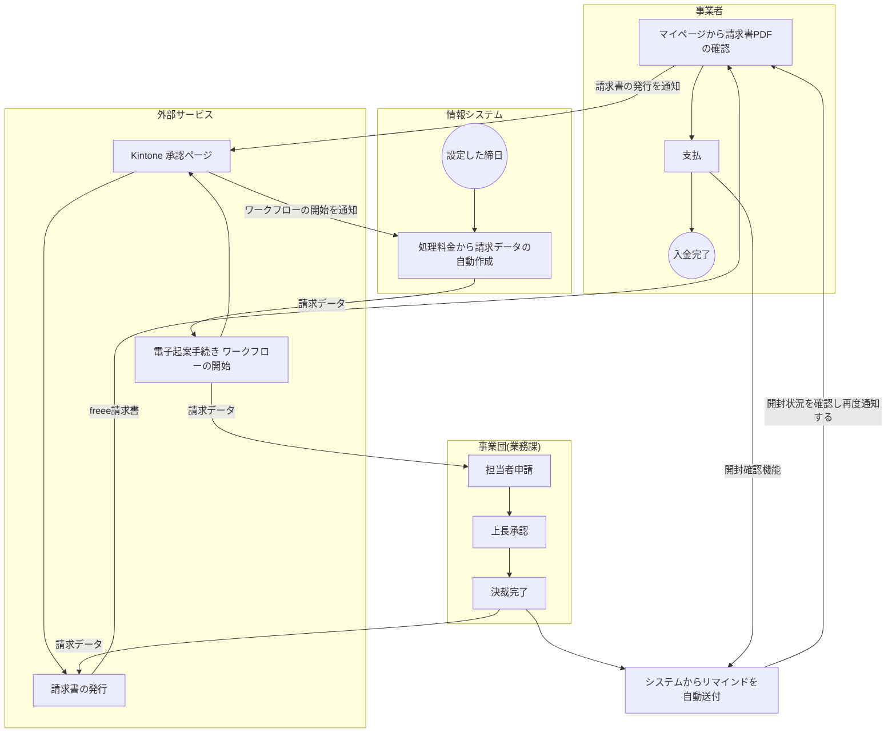

A swimlane flowchart showing the request processing flow across four lanes: 事業者 (Business), 事業団(業務課) (Business Group (Business Office)), 情報システム (Information System), and 外部サービス (External Service). The process starts with '設定した締日' (Set due date) in the Information System, leading to '処理料金から請求データの自動作成' (Automatic creation of request data from processing fees). This leads to '電子起案手続き ワークフローの開始' (Start of electronic proposal procedure workflow) in the External Service, which connects to '担当者申請' (Applicant's application) in the Business Group. The flow continues through '上長承認' (Supervisor approval) and '決裁完了' (Approval completed). From '決裁完了', the flow branches: one path goes to '請求書の発行' (Invoice issuance) in the External Service, which sends a '請求書の発行を通知' (Notification of invoice issuance) to the Business. Another path from '決裁完了' goes to 'Kintone 承認ページ' (Kintone approval page) in the External Service, which sends a 'ワークフローの開始を通知' (Notification of workflow start) to the Information System. The Business receives the notification and proceeds to 'マイページから請求書PDFの確認' (Confirmation of invoice PDF from my page), then '支払' (Payment), ending at '入金完了' (Payment completed). The Information System's '処理料金から請求データの自動作成' also sends '請求データ' (Request data) to the External Service. The External Service's '電子起案手続き' sends '請求データ' (Request data) to the Business Group. The Business Group's '決裁完了' also sends '請求データ' (Request data) to the External Service. The External Service's '請求書の発行' sends 'freee請求書' (freee invoice) to the Business. The Business's 'マイページから請求書PDFの確認' sends '開封状況を確認し再度通知する' (Check opening status and notify again) to the Information System. The Information System's '情報システム' sends 'システムからリマインドを自動送付' (Automatic sending of reminder from system) to the Business. The Business's '支払' sends '開封確認機能' (Opening confirmation function) to the Information System.

● 開始    ◎ 終了    ◇ 分岐    [アクティビティ]    </> 画面    ⚙ データ    📄 帳票    ✉ メール    → フロー    - - - フロー

Legend for the flowchart symbols: 開始 (Start) - solid circle, 終了 (End) - circle with a dot, 分岐 (Branch) - diamond, アクティビティ (Activity) - rounded rectangle, 画面 (Screen) - rectangle with , データ (Data) - cylinder, 帳票 (Form) - document icon, メール (Email) - envelope icon, フロー (Flow) - solid arrow, フロー (Flow) - dashed arrow.

## 5. 会計処理 ⑨入金管理(要検討)

| 事業者         | <div style="position: absolute; right: 50px; top: 50%; transform: translateY(-50%);"> <span style="display: inline-block; width: 30px; border-bottom: 1px solid black; vertical-align: middle;">→</span> </div>                                                                                                                            |
| -------------- | ------------------------------------------------------------------------------------------------------------------------------------------------------------------------------------------------------------------------------------------------------------------------------------------------------------------------------------------ |
| 事業団(総務課) |                                                                                                                                                                                                                                                                                                                                            |
| 情報システム   | <div style="display: inline-block; text-align: center; vertical-align: middle; margin-right: 20px;"> <p style="margin: 0;">設定した締日</p> </div> <div style="display: inline-block; border: 1px solid black; border-radius: 10px; padding: 10px; vertical-align: middle; text-align: center;"> 未収金の<br/>入金管理の<br/>自動化 </div> |
| 外部サービス   |                                                                                                                                                                                                                                                                                                                                            |

End symbol Start symbol

開始
終了
分岐
アクティビティ
画面
データ
帳票
メール
→ フロー
→ フロー

Start symbol End symbol Decision symbol Screen symbol Data symbol Document symbol Email symbol
